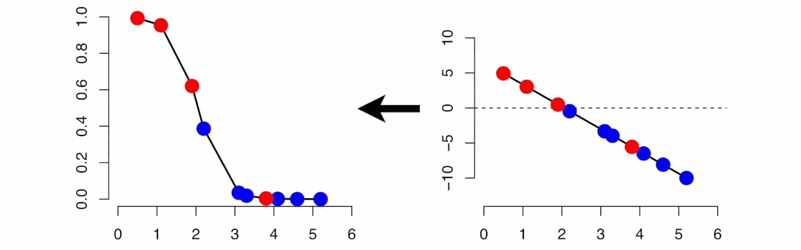
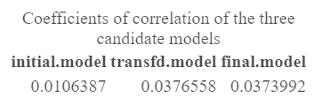
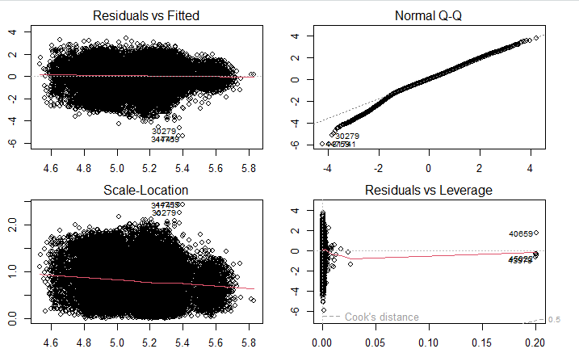
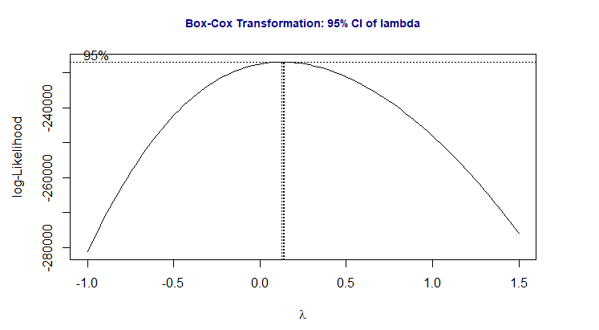
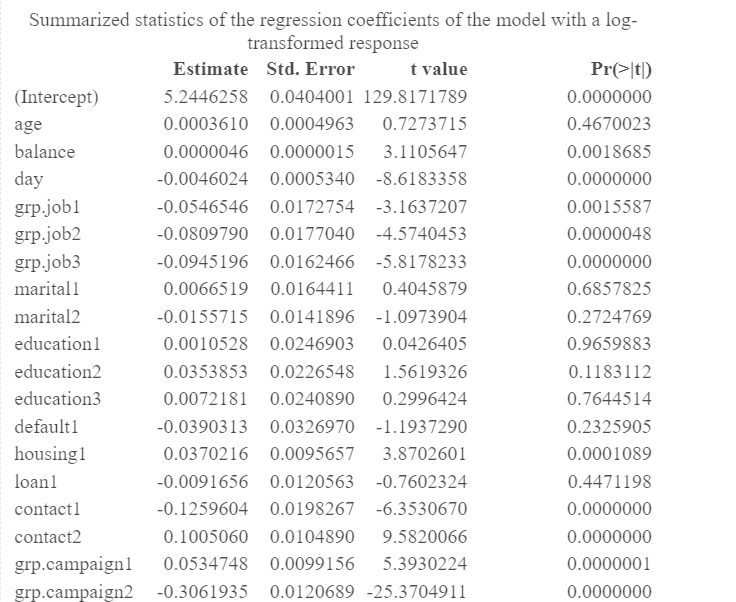
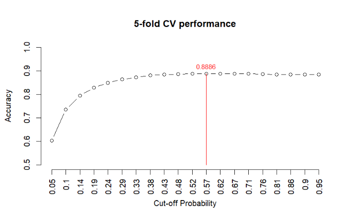
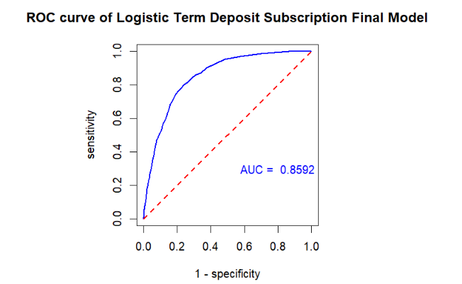
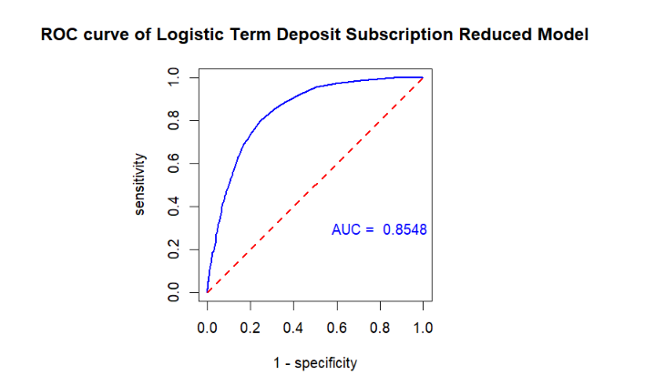
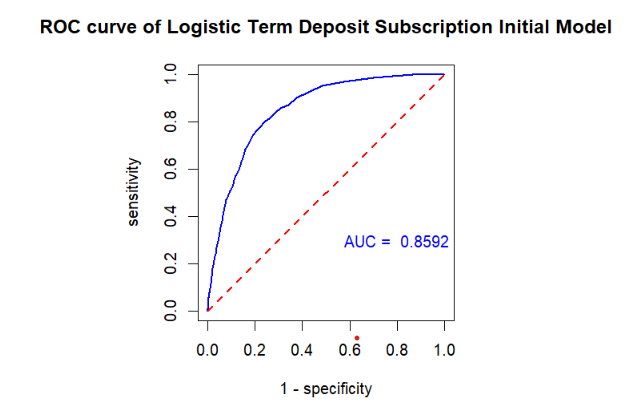
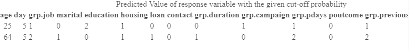

```{r setup, include=FALSE}
options(htmltools.dir.version = FALSE)
if (!require("knitr")) {
   install.packages("knitr")
   library(knitr)
}
if (!require("pander")) {
   install.packages("pander")
   library(pander)
}
if (!require("plotly")) {
   install.packages("plotly")
   library(plotly)
}
if (!require("ggplot2")) {
   install.packages("ggplot2")
   library(ggplot2)
}
knitr::opts_chunk$set(
                  fig.width=3, 
                  fig.height=3, 
                  fig.retina=12,
                  out.width = "100%",
                  cache = FALSE,
                  echo = TRUE,
                  message = FALSE, 
                  warning = FALSE,
                  hiline = TRUE
                  )
```


```{r xaringan-themer, include=FALSE, warning=FALSE}
library(xaringanthemer)
  style_duo_accent(primary_color = "#1F4257",
          secondary_color = "#380F2A",
          # fonts
          header_font_google = google_font("Martel"),
          text_font_google = google_font("Lato"),
          code_font_google = google_font("Fira Mono"))
```

class:inverse4, top

<h1 align="center"> Agenda</h1>
<BR>

.pull-left[
- Introduction
   
- Addressing Questions
   
- Candidate Models and Justifications
   
- Model Selection
   - Model Fit
   
- Results

- Conclusions

- Limitations
]

---

<h1 align = "center">Intro into Bank Marketing Data </h1>
<BR>

- Portuguese banking Institutions

- Collected from May 2008 to November 2010
   
- 45,211 observations

- model linear and logistic regression.

---
<h1 align = "center">Addressing <font color="orange">Questions</font></h1>
<BR>
.pull-left[
- Linear Regression
   -Association between variables and length of call?
   
   
   <br><br>
   <center>
   
   </center>
]
.pull-right[
- Logistic Regression
  - Predict client has subscribed after direct marketing campaigns
  
  
  <br><br>
  <center>
  
  </center>
]

---
name:Canidate models

<h1 align="center"> - Linear Candidate Models and <font color="orange">Justifications</font></h1>
<br>
<ol>
  <li><strong>Initial Model</strong>
    <ol>
      <li>Every term</li>
    </ol>
  </li>
  <li><strong>Reduced Model</strong>
    <ol>
      <li>Significant predictors</li>
    </ol>
  </li>
  <li><strong>Final Model</strong>
    <ol>
      <li>Step wise regression</li>
    </ol>
  </li>
</ol>
<br>
<br>
Initial linear regression equation
<left>
<p>duration = β₀ + β₁x₁ + β₂x₂ + β₃x₃+ β₄x₄ + β₅x₅ + β₆x₆ + β₇x₇</p>
<p>+ β₈x₈ + β₉x₉ + β₁+ β₁₁x₁₁ + β₁₂x₁₂ + β₁₃x₁₃</p>
<p>+ β₁₄x₁₄ + ε, where ε ~ N(0, σ²)</p>
<br>

---

<h1 align="center"> Model Selections and <font color="orange"> Cross-Validation</font></h1>
<ul>
  <li><strong>Cross-validation and MSE as Predictive Performance Measures</strong></li>
  <li><strong>Extract Coefficient of Determination (R²) from Candidate Models</strong></li>
</ul>
<br>
<center>
  
  </center>
 <ul>
  <li><strong>Reduced model is best</strong></li>
</ul> 
---

<h1 align="center">Model <font color="orange"> Assumptions</font></h1>
<ul>
  <li><strong> Normality Assumption violated</strong></li>
</ul>
<br>
<center>
  
  </center>
---

<h1 align="center">Model <font color="orange"> Transformations</font></h1>
<ul>
  <li><strong> Transformed using Box-Cox</strong></li>
  <li><strong> Fixed Normality violation</strong></li>
</ul>
<br>
<center>
  
  </center>
---
<h1 align="center">Model <font color="orange"> Results</font></h1>
<ul>
  <li><strong> Balance, day, job, housing, contact, and campaign are significant.</strong></li>
  <li><strong>Day and job negatively correlated to duration</strong></li>
  <li><strong>Balance, housing, contact and campaign are positively correlated</strong></li>
</ul>
<br>
<center>
  
  </center>
---
<h1 align="center"> - Linear Candidate Models and <font color="orange">Justifications</font></h1>
<br>
<ol>
  <li><strong>Variable, y, client has subscribed to a term deposit</strong></li>
  <li>Binary response</li>
  <li><strong>Initial Model</strong>
    <ol>
      <li>Every term</li>
    </ol>
  </li>
  <li><strong>Reduced Model</strong>
    <ol>
      <li>Significant predictors</li>
    </ol>
  </li>
  <li><strong>Final Model</strong>
    <ol>
      <li>Stepwise regression</li>
    </ol>
  </li>
</ol>
<br>
<br>
Initial logistic regression equation
<left>
<p>y = β₀ + β₁x₁ + β₂x₂ + β₃x₃+ β₄x₄ + β₅x₅ + β₆x₆ + β₇x₇</p>
<p>+ β₈x₈ + β₉x₉ + β₁+ β₁₁x₁₁ + β₁₂x₁₂ + β₁₃x₁₃</p>
<p>+ β₁₄x₁₄ + ε, where ε ~ N(0, σ²)</p>
<br>
---

<h1 align="center"> Logistical Model Selections and <font color="orange"> Cross-Validation</font></h1>
<ul>
  <li><strong> ROC curve and AUC Performance Measures</strong></li>
  <li><strong>randomly split the overall data set into two data sets</strong></li>
  <li><strong> 5-fold cross-validation for optimal cut-off probability of final model</strong></li>
</ul>
<center>
  
  </center>
 <ul>
  <li><strong>Best accuray is at .57</strong></li>
</ul> 
---
<h1 align="center"> ROC of <font color="orange">Final Model</font></h1>
<Br>
<center>
  
  </center>
---
<h1 align="center"> ROC of <font color="orange">Reduced Model</font></h1>
<br>
<center>
  
  </center>
---
<h1 align="center"> ROC of <font color="orange">Initial Model</font></h1>
<br>
<center>
  
  </center>
---
<h1 align="center"><font color="orange">Results</font></h1>
 <ul>
  <li><strong> Final model assessed</strong></li>
  <li><strong>Not Accurate</strong></li>
</ul>
   <center>
   <br><br>
   
   </center>
---
<h1 align="center"> Conclusions</h1>
<ul>
  <li>In our model, we cannot rely on the linear model as the assumptions have been violated.</li>
  <li>There is no strong evidence to support any claims made using the linear model.</li>
  <li>However, in our logistic model, we were able to accurately predict whether a client will subscribe to the marketing.</li>
</ul>
---
<h1 align="center"> Limitations</h1>
<ul>
  <li>Assumptions were violated in the linear model, making it unreliable.</li>
  <li>More EDA and wrangling is needed to fit the linear model.</li>
  <li>Reworking the questions might be a more viable solution.</li>
</ul>
<center>
   <br><br>
   
   </center>
