```{=html}

<style type="text/css">

/* Cascading Style Sheets (CSS) is a stylesheet language used to describe the presentation of a document written in HTML or XML. it is a simple mechanism for adding style (e.g., fonts, colors, spacing) to Web documents. */

h1.title {  /* Title - font specifications of the report title */
  font-size: 24px;
  font-weight: bold;
  color: DarkRed;
  text-align: center;
  font-family: "Gill Sans", sans-serif;
}
h4.author { /* Header 4 - font specifications for authors  */
  font-size: 18px;
  font-family: system-ui;
  color: red;
  text-align: center;
}
h4.date { /* Header 4 - font specifications for the date  */
  font-size: 18px;
  font-family: system-ui;
  color: DarkBlue;
  text-align: center;
  font-weight: bold;
}
h1 { /* Header 1 - font specifications for level 1 section title  */
    font-size: 22px;
    font-family: "Times New Roman", Times, serif;
    color: navy;
    text-align: center;
    font-weight: bold;
}
h2 { /* Header 2 - font specifications for level 2 section title */
    font-size: 20px;
    font-family: "Times New Roman", Times, serif;
    color: navy;
    text-align: left;
    font-weight: bold;
}

h3 { /* Header 3 - font specifications of level 3 section title  */
    font-size: 18px;
    font-family: "Times New Roman", Times, serif;
    color: navy;
    text-align: left;
}

h4 { /* Header 4 - font specifications of level 4 section title  */
    font-size: 18px;
    font-family: "Times New Roman", Times, serif;
    color: darkred;
    text-align: left;
}

body { background-color:white; }

.highlightme { background-color:yellow; }

p { background-color:white; }

</style>
```


\

# Introduction

The data is related with direct marketing campaigns of a Portuguese banking institution. The marketing campaigns were based on phone calls. Often, more than one contact to the same client was required. The data collected from these marketing capaigns was collected from May 2008 to November 2010. There is a total number of 45,211 observation in this data set. The data set consists of 17 variables, including the response variable with the name 'y'. A description of the predictor and outcome features are below:

1 - age (numeric)

2 - job : Job type (categorical): "admin.", "unknown", "unemployed", "management", "housemaid", "entrepreneur", "student", "blue-collar", "self-employed", "retired", "technician", "services"

3 - marital : Marital status (categorical): "married", "divorced", "single"
  
4 - education (categorical): "unknown","secondary","primary","tertiary"

5 - default: Does the client have credit in default? (binary: "yes","no")

6 - balance: Average yearly balance (numeric, in euros)

7 - housing: Does the client have a housing loan? (binary: "yes","no")

8 - loan: Does the client have a personal loan? (binary: "yes","no")

9 - contact: Contact communication type (categorical): "unknown","telephone","cellular"

10 - day: Last contact day of the month (numeric, discrete)

11 - month: Last contact month of year (categorical): "jan", "feb", "mar", "apr", "may", "jun", "jul",  "aug", "sep", "oct", "nov", "dec"

12 - duration: Last contact duration (numeric, in seconds)

13 - campaign: The number of contacts performed during this campaign and for this client (numeric, discrete)

14 - pdays: The number of days after the client was last contacted from a previous campaign (numeric, discrete)    

15 - previous: The number of contacts performed before this campaign and for this client (numeric)

16 - poutcome: The outcome of the previous marketing campaign (categorical): "unknown", "other", "failure", "success"

17 - y oOutcome class variable): Has the client subscribed a term deposit? (binary: "yes","no")

A public link to the data can be found here: https://archive.ics.uci.edu/dataset/222/bank+marketing


When looking at this dataset, two areas we would want to explore through linear and logistic regression.

1. If there is a association with any of the variables and how long of the duration of a call (Linear).

2. Predict if a client has subscribed a term deposit after direct marketing campaigns (Logistic).


```r
#Load the sample data
BankMarketing = read.csv("https://pengdsci.github.io/datasets/BankMarketing/BankMarketingCSV.csv")[, -1]
```

# Methodology

In order to answer the question "What factors are associated with time spent at the company" a multiple linear regression model must be built. The response variable of interest for this specific question is "time_spend_company", which depicts the amount of times in year an employee spends at IBM.

## Asumptions of Multible Linear and Logistical Regression

In order for a model to be built for multiple linear regression, the following assumptions must be made:
The response variable, "time_spend_company" is a normal random variable and its mean is influenced by explanatory variables but not the variance. All the explanatory variables are assumed to be non-random. They are assumed to be uncorrelated to each other, and must check for multi-collinearity.The data is a random sample. These are all assumed and the model is fitted, but these assumptions will be checked in exploratory data analysis.

The Assumptions of logistical regression are below.
There are three assumptions for the binary logistic regression model. These assumptions are that the response variable must be binary,the predictor variables are assumed to be uncorrelated, and t he functional form of the predictor variables is correctly specified.
## Candidate Models

Once we fit the assumptions of the model, we must create multiple candidate models in order to evaluate the best options. Here we fit three models, an initial, transformed, and a final model using step-wise selection, dropping insignificant terms. 

## Cross-Validation and Model Selection

For linear regression we will cross validate and select the model in the following way:
The data will be two-way split, with the entire sample into training data (80%) and testing data (20%). Then, creating 5-fold data, which will randomly split the training data into 5 folds of approximate equal size. Once the models are fit, cross-validation would be performed, using the 5 different combinations of folds. The performance of the model will be based on these folds. Finally the average of the MSE will be reported for selection.

The process for selecting the correct logistical model we be done in the following way:
The data will be split into 70% training/validation and 30% testing. The performance metric to be used is the AUC. The average of the validated AUC will be compared with the AUC calculated from the testing data. We will find the optimal point on the ROC curve that meets the requirements of sensitivity and specificity. For other optimal points such as the point that maximizes the accuracy of the prediction, we can use the same process to search the cut-off probability.

# EDA and Feature Engineering

In oder to perfom so EDA, we must have a basic understanding of the data. A summary of teh data is printed below.


```r
#Summarized descriptive statistics for all variables in the data set
summary(BankMarketing)
```

```
##       age            job              marital           education        
##  Min.   :18.00   Length:45211       Length:45211       Length:45211      
##  1st Qu.:33.00   Class :character   Class :character   Class :character  
##  Median :39.00   Mode  :character   Mode  :character   Mode  :character  
##  Mean   :40.94                                                           
##  3rd Qu.:48.00                                                           
##  Max.   :95.00                                                           
##    default             balance         housing              loan          
##  Length:45211       Min.   : -8019   Length:45211       Length:45211      
##  Class :character   1st Qu.:    72   Class :character   Class :character  
##  Mode  :character   Median :   448   Mode  :character   Mode  :character  
##                     Mean   :  1362                                        
##                     3rd Qu.:  1428                                        
##                     Max.   :102127                                        
##    contact               day           month              duration     
##  Length:45211       Min.   : 1.00   Length:45211       Min.   :   0.0  
##  Class :character   1st Qu.: 8.00   Class :character   1st Qu.: 103.0  
##  Mode  :character   Median :16.00   Mode  :character   Median : 180.0  
##                     Mean   :15.81                      Mean   : 258.2  
##                     3rd Qu.:21.00                      3rd Qu.: 319.0  
##                     Max.   :31.00                      Max.   :4918.0  
##     campaign          pdays          previous          poutcome        
##  Min.   : 1.000   Min.   : -1.0   Min.   :  0.0000   Length:45211      
##  1st Qu.: 1.000   1st Qu.: -1.0   1st Qu.:  0.0000   Class :character  
##  Median : 2.000   Median : -1.0   Median :  0.0000   Mode  :character  
##  Mean   : 2.764   Mean   : 40.2   Mean   :  0.5803                     
##  3rd Qu.: 3.000   3rd Qu.: -1.0   3rd Qu.:  0.0000                     
##  Max.   :63.000   Max.   :871.0   Max.   :275.0000                     
##       y            
##  Length:45211      
##  Class :character  
##  Mode  :character  
##                    
##                    
## 
```

We can see from the above summary table that the distribution of some of the numeric variables is skewed and contains outliers that need to be further explored. 

## Handling Missing Values

This dataset does not contain any missing values, therefore we do not have to drop any rows or input any values.


## Single Variable Distribution

The distribution for our continuous numerical variables for average_monthly_hours and time_spend_company are shown below. Time spent is skewed to the right, and is not normal. Average monthly hours so not too bad, and can be deemed approxiatly normal.

In order to examine and determine the outcome of any of the outliers and looking at the skewness of certain numerical variables, such as "duration", discretization will be used to divide the different categorical varibles into groups. This variable should be discretized due to thenumber of high outliers it contains. In looking at this variable's distribution, the three groups that were created (0-180, 181-319, and 320+) seem similar enough in the frequency of client observations. This new variable will now be used for building future models. The histogram can be seen below.


```r
# histogram showing the distribution of the duration variable
hist(BankMarketing$duration, xlab = "Duration", ylab = "count", main = "Durations of Last Contact")
```

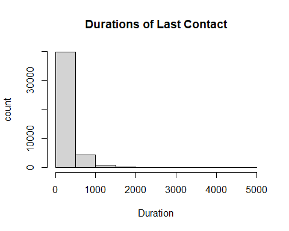


```r
# New grouping variable for duration
BankMarketing$grp.duration <- ifelse(BankMarketing$duration <= 180, '0-180',
               ifelse(BankMarketing$duration >= 320, '320+', '[181, 319]'))
```


Now we want to look at some of the categorical and binary features. When looking at the distribution of contacts performed during the campain, it is Skewed to the right. This means that groups should be created. For campaign, the value of 1 contact should be its own group since it has the highest frequency of observations. Values 2 & 3 number of contacts combined have close to the same frequency, so they should be paired together in their own group. The remaining observations should be combined into the final group. 

When looking at pdays, the value of -1 is an indicator that a client was not previously contacted before the campaign. Since this makes up most of the obersvations, it will become its own group. The rest of the observations were split into groups of 1-200 days and 200 days or more. 


The previous variable was also split into 3 groups. The value of 0 contacts is one group since it has the most observations. The values of 1 to 3 contacts is another category since they both make a fair amount of the observations. Same goes for observations with 4 or more contacts.

All of these bar plots can be seen below.

```r
# barplot showing the distribution of the campaign variable
marketcampaigns = table(BankMarketing$campaign)
barplot(marketcampaigns, main = "Distribution of Contacts Performed During Campaign", xlab = "Number of Contacts")
```

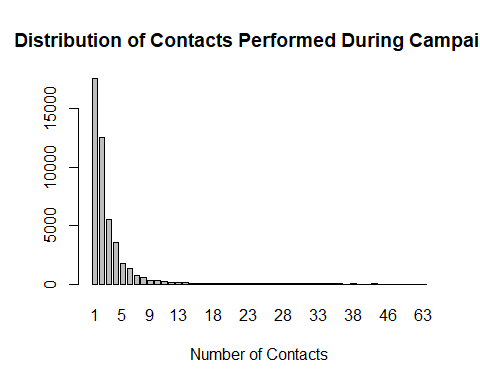


```r
# barplot showing the distribution of the pdays variable
dayspassed = table(BankMarketing$pdays)
barplot(dayspassed, main = "Distribution of Days Passed After Client Last Contacted (Pdays) ", xlab = "Number of Days")
```

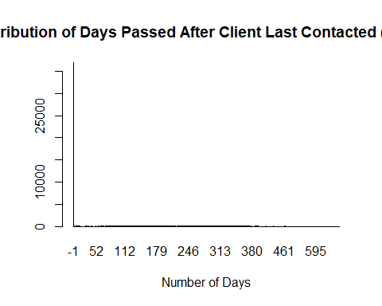


```r
# barplot showing the distribution of the previous variable
prev = table(BankMarketing$previous)
barplot(prev, main = "Distribution of Previous Contacts", xlab = "Number of Contacts")
```

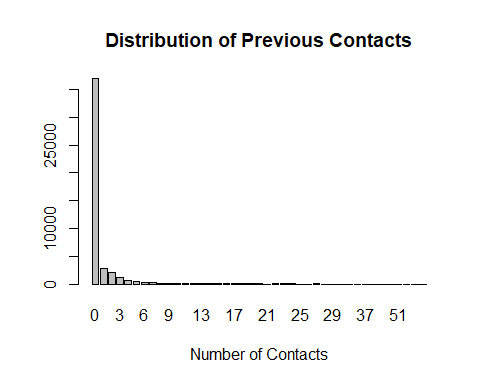
These new grouped variables will be used in future model build. The categories for each variable are as follows:

campaign: 1, 2-3, 4+
pdays: -1, 1-199, 200+
previous: 0, 1-3, 4+


```r
# New grouping variable for month
BankMarketing$grp.campaign <- ifelse(BankMarketing$campaign <= 1, '1',
               ifelse(BankMarketing$campaign >= 4, '4+', '[2, 3]'))

# New grouping variable for pdays
BankMarketing$grp.pdays <- ifelse(BankMarketing$pdays <= -1, 'Client Not Previously Contacted', ifelse(BankMarketing$pdays >= 200, '200+', '[1, 199]'))

# New grouping variable for previous
BankMarketing$grp.previous <- ifelse(BankMarketing$previous <= 0, '0',
               ifelse(BankMarketing$previous > 4, '4+', '[1,3]'))
```


Now we move onto categorical varibles.

The categorical variable of month has also been discretized by seasons since the bar plot below is also skewed for certain months. Also, handling smaller groups into seasons is easier than hanling 12 months. A new feature called "seasons" was created.


```r
# barplot showing the distribution of the month variable
seasons = table(BankMarketing$month)
barplot(seasons, main = "Distribution of Number of Contacts by Month", xlab = "Number of Contacts")
```

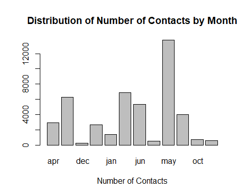

```r
# New grouping variable for month
BankMarketing$grp.month <-  ifelse((BankMarketing$month == 'mar' | BankMarketing$month == 'apr' | BankMarketing$month == 'may'), 'spring',
                            ifelse((BankMarketing$month == 'jun' | BankMarketing$month == 'jul' | BankMarketing$month == 'aug'), 'summer', 
                            ifelse((BankMarketing$month == 'sep' | BankMarketing$month == 'oct' | BankMarketing$month == 'nov'), 'fall', 'winter')))
```


```r
# barplot showing the distribution of the job variable
jobcategory = table(BankMarketing$job)
barplot(jobcategory, main = "Distribution of Job Type", xlab = "Number of Clients in Each Job")
```

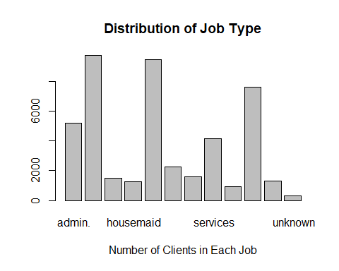

```r
# New grouping variable for job
BankMarketing$grp.job = ifelse(BankMarketing$job == " unknown", "not working", ifelse(BankMarketing$job == " unemployed", "not working", ifelse(BankMarketing$job == " retired", "not working", ifelse(BankMarketing$job == " blue-collar", "workers", ifelse(BankMarketing$job == " entrepreneur", "bosses", ifelse(BankMarketing$job == " housemaid", "workers", ifelse(BankMarketing$job == " management", "bosses", ifelse(BankMarketing$job == " self-employed", "bosses", ifelse(BankMarketing$job == " services", "white-collar", ifelse(BankMarketing$job == " technician", "white-collar", ifelse(BankMarketing$job == " student", "not working", "white-collar")))))))))))
```

Now that we have Now that the variables have been discretized, and created new variables, the dataset now must be cleaned to reflect those changes.


```r
# Assembling the discretized variables and other variables to make the modeling data set
var.names = c("age", "balance", "day", "grp.job", "marital", "education", "default", "housing", "loan", "contact", "grp.month", "grp.duration", "grp.campaign", "grp.pdays", "grp.previous", "poutcome", "y") 

BankMarketingCampaign <- BankMarketing[, var.names]
#BankMarketingCampaign = BankMarketing[,var.names]
```
## Assessing Pairwised Relationship
We want to see if there is any linear association between the numeric variables. A Pairwise scatter plot like below, is a good visual. This scatterplot blow looks at the data.


```r
# Pair-wise scatter plot for numeric variables
ggpairs(BankMarketingCampaign,  # Data frame
        columns = 1:3,  # Columns
        aes(color = y,  # Color by group (cat. variable)
            alpha = 0.5))
```

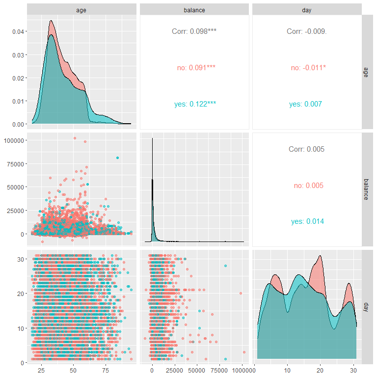
We see that none of the numeric variables appear to be significantly correlated when looking at the numbers. But, the stacked density cures and no completely overlapping, indicating a week correlation between the numeric variables and our response 'y'. The strongest but 'weak correlation we can see through the plots is age and balance.


Now that we looked at the numeric variables, we can turn the attention to categorical variables and dependency. In order to see dependency, mosaic plots will be shown below.


```r
# Mosaic plots to show categorical variable dependency to the response.
par(mfrow = c(2,2))
mosaicplot(grp.job ~ y, data=BankMarketingCampaign,col=c("Blue","Red"), main="job vs term deposit ")
mosaicplot(marital ~ y, data=BankMarketingCampaign,col=c("Blue","Red"), main="marital vs term deposit ")
mosaicplot(education ~ y, data=BankMarketingCampaign,col=c("Blue","Red"), main="education vs term deposit ")
mosaicplot(default ~ y, data=BankMarketingCampaign,col=c("Blue","Red"), main="default vs term deposit ")
```


```r
# Mosaic plots to show categorical variable dependency to the response.
par(mfrow = c(2,2))
mosaicplot(housing ~ y, data=BankMarketingCampaign,col=c("Blue","Red"), main="housing vs term deposit ")
mosaicplot(loan ~ y, data=BankMarketingCampaign,col=c("Blue","Red"), main="loan vs term deposit ")
mosaicplot(contact ~ y, data=BankMarketingCampaign,col=c("Blue","Red"), main="contact vs term deposit ")
mosaicplot(grp.month ~ y, data=BankMarketingCampaign,col=c("Blue","Red"), main="month vs term deposit ")
```

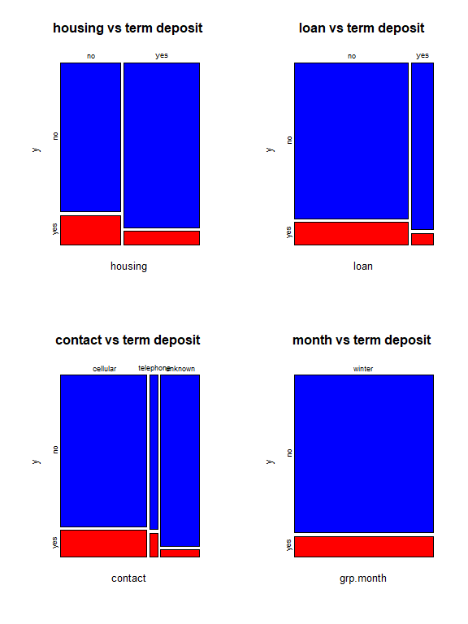


```r
# Mosaic plots to show categorical variable dependency to the response.
par(mfrow = c(3,2))
mosaicplot(grp.duration ~ y, data=BankMarketingCampaign,col=c("Blue","Red"), main="duration vs term deposit ")
mosaicplot(grp.campaign ~ y, data=BankMarketingCampaign,col=c("Blue","Red"), main="campaign vs term deposit ")
mosaicplot(grp.pdays ~ y, data=BankMarketingCampaign,col=c("Blue","Red"), main="pdays vs term deposit ")
mosaicplot(grp.previous ~ y, data=BankMarketingCampaign,col=c("Blue","Red"), main="previous vs term deposit ")
mosaicplot(poutcome ~ y, data=BankMarketingCampaign,col=c("Blue","Red"), main="poutcome vs term deposit ")
```

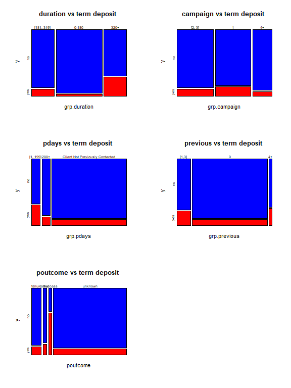


# Linear Regression Modeling

We can use a linear model for finding association variables and the duration of the phone calls in seconds.The variable, duration, which tells tells how long the phone call last is the reponse response variable.

Before we can model, all binary and categorical variables must be changes to numerical dummy variables. This is done below.


```r
# Create numerical value labels for categorical variables
BankMarketingCampaign$y <- factor(BankMarketingCampaign$y, levels = c(" no", " yes"), labels = c("0", "1"))

BankMarketingCampaign$grp.job <- factor(BankMarketingCampaign$grp.job, levels = c("not working", "workers", "bosses", "white-collar"), labels = c("0", "1", "2", "3"))

BankMarketingCampaign$marital <- factor(BankMarketingCampaign$marital, levels = c(" divorced", " single", " married"), labels = c("0", "1", "2"))

BankMarketingCampaign$education <- factor(BankMarketingCampaign$education, levels = c(" unknown", " primary", " secondary", " tertiary"), labels = c("0", "1", "2", "3"))
  
BankMarketingCampaign$housing <- factor(BankMarketingCampaign$housing, levels = c(" no", " yes"), labels = c("0", "1"))
  
BankMarketingCampaign$loan <- factor(BankMarketingCampaign$loan, levels = c(" no", " yes"), labels = c("0", "1"))
BankMarketingCampaign$default <- factor(BankMarketingCampaign$default, levels = c(" no", " yes"), labels = c("0", "1"))
BankMarketingCampaign$contact <- factor(BankMarketingCampaign$contact, levels = c(" unknown", " telephone", " cellular"), labels = c("0", "1", "2"))

BankMarketingCampaign$grp.month <- factor(BankMarketingCampaign$grp.month, levels = c("winter", "spring", "summer", "fall"), labels = c("0", "1", "2", "3"))

BankMarketingCampaign$grp.duration <- factor(BankMarketingCampaign$grp.duration, levels = c("0-180", "[181, 319]", "320+"), labels = c("0", "1", "2"))
  
BankMarketingCampaign$grp.campaign <- factor(BankMarketingCampaign$grp.campaign, levels = c("1", "[2, 3]", "4+"), labels = c("0", "1", "2"))
  
BankMarketingCampaign$grp.pdays <- factor(BankMarketingCampaign$grp.pdays, levels = c("Client Not Previously Contacted", "[1, 199]", "200+"), labels = c("0", "1", "2"))
  
BankMarketingCampaign$grp.previous <- factor(BankMarketingCampaign$grp.previous, levels = c("0", "[1,3]", "4+"), labels = c("0", "1", "2"))
  
BankMarketingCampaign$poutcome <- factor(BankMarketingCampaign$poutcome, levels = c(" unknown", " success", " failure", "  other"), labels = c("0", "1", "2", "3"))
```


```r
#Linear Dataset
BankMarketingL <- BankMarketingCampaign %>%
   mutate(y = BankMarketingCampaign$y, 
          age=BankMarketingCampaign$age,
          balance=BankMarketingCampaign$balance,
          day = BankMarketingCampaign$day,
         grp.job = BankMarketingCampaign$grp.job,
         marital = BankMarketingCampaign$marital,
         education = BankMarketingCampaign$education,
         housing = BankMarketingCampaign$housing,
         loan = BankMarketingCampaign$loan,
         default = BankMarketingCampaign$default,
         contact=BankMarketingCampaign$contact,
         grp.campaign = BankMarketingCampaign$grp.campaign,
         grp.pdays =BankMarketingCampaign$grp.pdays,
         grp.previous = BankMarketingCampaign$grp.previous,
         poutcome = BankMarketingCampaign$poutcome, 
         duration = BankMarketing$duration)

BankMarketingL <- BankMarketingL[BankMarketingL$duration > 0, ]
```


## Create Candidate Models

The full/initial model containing all of the predictor variables will be made first, with 'duration' (length of call in seconds) as the response. The variables balance and default are not included since our EDA showed that removing them from the model might help the results.


```r
# Create the initial full model
initial.model =lm(duration ~ age + balance + day + grp.job + marital + education + default + housing + loan + contact + grp.campaign+grp.pdays+grp.previous+poutcome, data = BankMarketingL)

plot(initial.model)
```

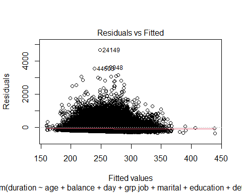<!-- --><!-- -->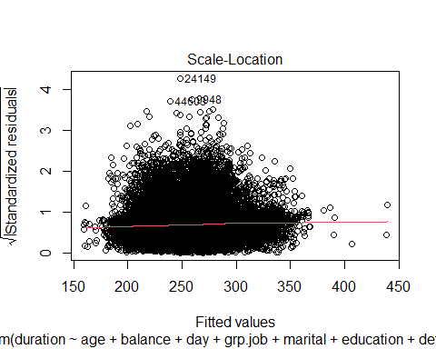<!-- -->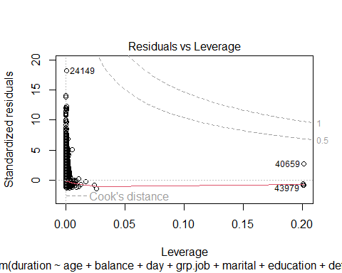<!-- -->

```r
coefficient.table = summary(initial.model)$coef
kable(coefficient.table, caption = "Significance tests of logistic regression model")
```


Table: Significance tests of logistic regression model

|              |     Estimate|  Std. Error|    t value| Pr(>&#124;t&#124;)|
|:-------------|------------:|-----------:|----------:|------------------:|
|(Intercept)   |  278.1019715|  11.3974233| 24.4004249|          0.0000000|
|age           |    0.0083785|   0.1400149|  0.0598403|          0.9522831|
|balance       |    0.0016194|   0.0004136|  3.9150836|          0.0000905|
|day           |   -0.7807526|   0.1506568| -5.1823251|          0.0000002|
|grp.job1      |  -11.0742342|   4.8736308| -2.2722760|          0.0230747|
|grp.job2      |  -21.2324631|   4.9945461| -4.2511297|          0.0000213|
|grp.job3      |  -25.5521708|   4.5833783| -5.5749644|          0.0000000|
|marital1      |    2.4519149|   4.6382482|  0.5286295|          0.5970652|
|marital2      |  -10.6850180|   4.0030828| -2.6691974|          0.0076061|
|education1    |   -3.0816026|   6.9654635| -0.4424117|          0.6581935|
|education2    |    3.0902802|   6.3912414|  0.4835180|          0.6287304|
|education3    |    0.8134778|   6.7958463|  0.1197022|          0.9047196|
|default1      |  -16.8459618|   9.2242703| -1.8262650|          0.0678172|
|housing1      |   11.3060522|   2.6986059|  4.1895900|          0.0000280|
|loan1         |   -4.0230166|   3.4012535| -1.1828041|          0.2368933|
|contact1      |   -8.9728967|   5.5933888| -1.6041968|          0.1086780|
|contact2      |   15.5759868|   2.9591009|  5.2637565|          0.0000001|
|grp.campaign1 |   14.4395410|   2.7973165|  5.1619261|          0.0000002|
|grp.campaign2 |  -30.5705356|   3.4047983| -8.9786627|          0.0000000|
|grp.pdays1    |   89.7478592| 114.9371431|  0.7808430|          0.4348991|
|grp.pdays2    |   92.0183672| 114.9937921|  0.8002029|          0.4235976|
|grp.previous1 |   -8.1042460|   8.6448724| -0.9374628|          0.3485258|
|poutcome1     |  -36.2983161| 114.9997510| -0.3156382|          0.7522786|
|poutcome2     | -110.1359174| 114.8666385| -0.9588155|          0.3376570|

We can see that there are some insignificant predictor variables, and they should be dropped from the model to create a reduced model. Using the step() function, we will now find  reduced and final models. The final best model will be a model that is between the full and reduced models.


```r
library(MASS)
boxcox(duration ~ age + balance + day + grp.job + marital + education + default + housing + loan + contact + grp.campaign+grp.pdays+grp.previous+poutcome, 
       data = BankMarketingL, 
       lambda = seq(-1, 1.5, length = 10), 
       xlab=expression(paste(lambda)))
title(main = "Box-Cox Transformation: 95% CI of lambda",
      col.main = "navy", cex.main = 0.9)
```

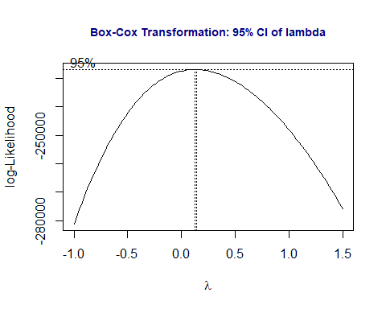<!-- -->

```r
transform.model = lm(log(duration) ~ age + balance + day + grp.job + marital + education + default + housing + loan + contact + grp.campaign+grp.pdays+grp.previous+poutcome, data  = BankMarketingL)
par(mfrow=c(2,2), mar = c(2,2,2,2))
plot(transform.model)
```

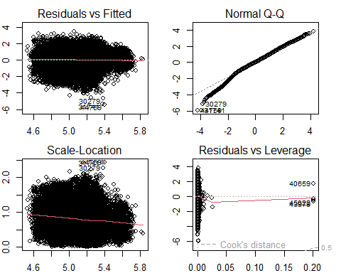<!-- -->

```r
kable(summary(transform.model)$coef, caption = "Summarized statistics of the regression 
      coefficients of the model with a log-transformed response")
```


Table: Summarized statistics of the regression 
      coefficients of the model with a log-transformed response

|              |   Estimate| Std. Error|     t value| Pr(>&#124;t&#124;)|
|:-------------|----------:|----------:|-----------:|------------------:|
|(Intercept)   |  5.2446258|  0.0404001| 129.8171789|          0.0000000|
|age           |  0.0003610|  0.0004963|   0.7273715|          0.4670023|
|balance       |  0.0000046|  0.0000015|   3.1105647|          0.0018685|
|day           | -0.0046024|  0.0005340|  -8.6183358|          0.0000000|
|grp.job1      | -0.0546546|  0.0172754|  -3.1637207|          0.0015587|
|grp.job2      | -0.0809790|  0.0177040|  -4.5740453|          0.0000048|
|grp.job3      | -0.0945196|  0.0162466|  -5.8178233|          0.0000000|
|marital1      |  0.0066519|  0.0164411|   0.4045879|          0.6857825|
|marital2      | -0.0155715|  0.0141896|  -1.0973904|          0.2724769|
|education1    |  0.0010528|  0.0246903|   0.0426405|          0.9659883|
|education2    |  0.0353853|  0.0226548|   1.5619326|          0.1183112|
|education3    |  0.0072181|  0.0240890|   0.2996424|          0.7644514|
|default1      | -0.0390313|  0.0326970|  -1.1937290|          0.2325905|
|housing1      |  0.0370216|  0.0095657|   3.8702601|          0.0001089|
|loan1         | -0.0091656|  0.0120563|  -0.7602324|          0.4471198|
|contact1      | -0.1259604|  0.0198267|  -6.3530670|          0.0000000|
|contact2      |  0.1005060|  0.0104890|   9.5820066|          0.0000000|
|grp.campaign1 |  0.0534748|  0.0099156|   5.3930224|          0.0000001|
|grp.campaign2 | -0.3061935|  0.0120689| -25.3704911|          0.0000000|
|grp.pdays1    |  0.3727512|  0.4074141|   0.9149197|          0.3602389|
|grp.pdays2    |  0.3298483|  0.4076149|   0.8092154|          0.4183957|
|grp.previous1 |  0.0334652|  0.0306432|   1.0920923|          0.2747986|
|poutcome1     | -0.1099400|  0.4076360|  -0.2697013|          0.7873914|
|poutcome2     | -0.4576910|  0.4071642|  -1.1240945|          0.2609792|

```r
##
final.model =  step(transform.model, direction = "backward", trace = 0)
kable(summary(final.model)$coef, caption = "Summary statistics of the regression 
      coefficients of the final model")
```


Table: Summary statistics of the regression 
      coefficients of the final model

|              |   Estimate| Std. Error|     t value| Pr(>&#124;t&#124;)|
|:-------------|----------:|----------:|-----------:|------------------:|
|(Intercept)   |  5.2568691|  0.0270577| 194.2834143|          0.0000000|
|balance       |  0.0000049|  0.0000015|   3.3433635|          0.0008284|
|day           | -0.0045638|  0.0005332|  -8.5599667|          0.0000000|
|grp.job1      | -0.0608151|  0.0168262|  -3.6143003|          0.0003015|
|grp.job2      | -0.0863436|  0.0174652|  -4.9437415|          0.0000008|
|grp.job3      | -0.0981317|  0.0158954|  -6.1735990|          0.0000000|
|education1    | -0.0015857|  0.0246293|  -0.0643814|          0.9486669|
|education2    |  0.0336210|  0.0225818|   1.4888525|          0.1365335|
|education3    |  0.0085905|  0.0239801|   0.3582348|          0.7201693|
|housing1      |  0.0341156|  0.0093986|   3.6298434|          0.0002839|
|contact1      | -0.1263981|  0.0196831|  -6.4216538|          0.0000000|
|contact2      |  0.0996263|  0.0104714|   9.5141151|          0.0000000|
|grp.campaign1 |  0.0522764|  0.0099031|   5.2788041|          0.0000001|
|grp.campaign2 | -0.3083250|  0.0120384| -25.6117119|          0.0000000|
|poutcome1     |  0.2836532|  0.0243289|  11.6591264|          0.0000000|
|poutcome2     | -0.0791844|  0.0145742|  -5.4332078|          0.0000001|

## Use Cross-validation for Model Selection

Use cross-validation and MSE as a predictive performance measure to select the best model.

Now we have three candidate models to select from. We extract the coefficient of determination R2
of each of the three candidate models.

```r
r.ini.model = summary(initial.model)$r.squared
r.transfd.model = summary(transform.model)$r.squared
r.final.model = summary(final.model)$r.squared
##
Rsquare = cbind(initial.model = r.ini.model, transfd.model = r.transfd.model, 
                final.model = r.final.model)
kable(Rsquare, caption="Coefficients of correlation of the three candidate models")
```


Table: Coefficients of correlation of the three candidate models

| initial.model| transfd.model| final.model|
|-------------:|-------------:|-----------:|
|     0.0106387|     0.0376558|   0.0373992|
All three of these models are frankly terrible with Rsquare scores of 1.1, 3.76 and 3.37. Out of the three the best performing model is the reduced/transformed model. The summary of the transformed model is seen below.

```r
kable(summary(transform.model)$coef, caption = "Summarized statistics of the regression 
      coefficients of the model with a log-transformed response")
```


Table: Summarized statistics of the regression 
      coefficients of the model with a log-transformed response

|              |   Estimate| Std. Error|     t value| Pr(>&#124;t&#124;)|
|:-------------|----------:|----------:|-----------:|------------------:|
|(Intercept)   |  5.2446258|  0.0404001| 129.8171789|          0.0000000|
|age           |  0.0003610|  0.0004963|   0.7273715|          0.4670023|
|balance       |  0.0000046|  0.0000015|   3.1105647|          0.0018685|
|day           | -0.0046024|  0.0005340|  -8.6183358|          0.0000000|
|grp.job1      | -0.0546546|  0.0172754|  -3.1637207|          0.0015587|
|grp.job2      | -0.0809790|  0.0177040|  -4.5740453|          0.0000048|
|grp.job3      | -0.0945196|  0.0162466|  -5.8178233|          0.0000000|
|marital1      |  0.0066519|  0.0164411|   0.4045879|          0.6857825|
|marital2      | -0.0155715|  0.0141896|  -1.0973904|          0.2724769|
|education1    |  0.0010528|  0.0246903|   0.0426405|          0.9659883|
|education2    |  0.0353853|  0.0226548|   1.5619326|          0.1183112|
|education3    |  0.0072181|  0.0240890|   0.2996424|          0.7644514|
|default1      | -0.0390313|  0.0326970|  -1.1937290|          0.2325905|
|housing1      |  0.0370216|  0.0095657|   3.8702601|          0.0001089|
|loan1         | -0.0091656|  0.0120563|  -0.7602324|          0.4471198|
|contact1      | -0.1259604|  0.0198267|  -6.3530670|          0.0000000|
|contact2      |  0.1005060|  0.0104890|   9.5820066|          0.0000000|
|grp.campaign1 |  0.0534748|  0.0099156|   5.3930224|          0.0000001|
|grp.campaign2 | -0.3061935|  0.0120689| -25.3704911|          0.0000000|
|grp.pdays1    |  0.3727512|  0.4074141|   0.9149197|          0.3602389|
|grp.pdays2    |  0.3298483|  0.4076149|   0.8092154|          0.4183957|
|grp.previous1 |  0.0334652|  0.0306432|   1.0920923|          0.2747986|
|poutcome1     | -0.1099400|  0.4076360|  -0.2697013|          0.7873914|
|poutcome2     | -0.4576910|  0.4071642|  -1.1240945|          0.2609792|

## Results and Conclusions

Report results based on the final model and conclude the statement of questions.

In summary, balance, day, job, housing, contact, and campaign are statistically significant (p-value <.05). Day and job negatively correlated to duration. Balance, housing, contact and campaign are positively correlated. When given a the balance of an account (balance) and increases by 1 , and all other variables are held constant, there is an 0.0000046 second increase in duration. Alternatively, when given the day  and it changes to the next, and all other variables are held constant, there is a 0.0046024 second decrease in the duration of a call.

# Logistic Regression

We can use a logistical model for predicting whether or not a client has subscribed a term deposit after direct marketing campaigns.The variable, y, which tells whether a client has subscribed a term deposit, acts as the binary response variable of all the logistic models. The rest of the variables, including the new discretized variables, of the revised data set act as the predictor variables that will possibly affect the response 'y'.


## Create Candidate Models


The full/initial model containing all of the predictor variables will be made first, with 'y' (whether or not a client has subscribed a term deposit) as the response. The variables balance and default are not included since our EDA showed that removing them from the model might help the results.


```r
# Create the initial full model
initial.model = glm(y ~ age + day + grp.job + marital + education + housing + loan + contact + grp.duration + grp.campaign + grp.pdays + grp.previous, family = binomial, data = BankMarketingCampaign)
coefficient.table = summary(initial.model)$coef
kable(coefficient.table, caption = "Significance tests of logistic regression model")
```


Table: Significance tests of logistic regression model

|              |   Estimate| Std. Error|    z value| Pr(>&#124;z&#124;)|
|:-------------|----------:|----------:|----------:|------------------:|
|(Intercept)   | -3.5018560|  0.1521815| -23.011052|          0.0000000|
|age           |  0.0037427|  0.0017733|   2.110553|          0.0348108|
|day           | -0.0055270|  0.0020224|  -2.732896|          0.0062780|
|grp.job1      | -0.5356687|  0.0623519|  -8.591057|          0.0000000|
|grp.job2      | -0.4527472|  0.0599608|  -7.550719|          0.0000000|
|grp.job3      | -0.3669178|  0.0546304|  -6.716368|          0.0000000|
|marital1      |  0.1692006|  0.0610871|   2.769826|          0.0056086|
|marital2      | -0.1806493|  0.0536963|  -3.364279|          0.0007674|
|education1    | -0.2609743|  0.0938475|  -2.780833|          0.0054220|
|education2    | -0.1221068|  0.0829586|  -1.471899|          0.1410481|
|education3    |  0.1775338|  0.0866458|   2.048960|          0.0404660|
|housing1      | -0.7303848|  0.0366351| -19.936773|          0.0000000|
|loan1         | -0.5591949|  0.0540381| -10.348154|          0.0000000|
|contact1      |  0.9550897|  0.0817113|  11.688589|          0.0000000|
|contact2      |  1.0053064|  0.0523061|  19.219696|          0.0000000|
|grp.duration1 |  1.3339942|  0.0503148|  26.512978|          0.0000000|
|grp.duration2 |  2.7044986|  0.0458332|  59.007422|          0.0000000|
|grp.campaign1 | -0.3253327|  0.0364818|  -8.917665|          0.0000000|
|grp.campaign2 | -0.5201170|  0.0505253| -10.294181|          0.0000000|
|grp.pdays1    |  1.4641585|  0.0758033|  19.315236|          0.0000000|
|grp.pdays2    |  0.6043423|  0.0869219|   6.952701|          0.0000000|
|grp.previous1 | -0.2153398|  0.0777604|  -2.769273|          0.0056181|
We can see that there are some insignificant predictor variables, and they should be dropped from the model to create a reduced model. Using the step() function, we will now find  reduced and final models. The final best model will be a model that is between the full and reduced models.


```r
# Creating the reduced and final models
full.model = initial.model  # the *biggest model* that includes all predictor variables
reduced.model = glm(y ~ day + grp.job + marital + housing + loan + contact + grp.duration + grp.campaign + grp.previous, family = binomial, data = BankMarketingCampaign)
final.model =  step(full.model, 
                    scope=list(lower=formula(reduced.model),upper=formula(full.model)),
                    data = BankMarketingCampaign, 
                    direction = "backward",
                    trace = 0)   # trace = 0: suppress the detailed selection process
final.model.coef = summary(final.model)$coef
kable(final.model.coef, caption = "Summary table of significant tests")
```


Table: Summary table of significant tests

|              |   Estimate| Std. Error|    z value| Pr(>&#124;z&#124;)|
|:-------------|----------:|----------:|----------:|------------------:|
|(Intercept)   | -3.5018560|  0.1521815| -23.011052|          0.0000000|
|age           |  0.0037427|  0.0017733|   2.110553|          0.0348108|
|day           | -0.0055270|  0.0020224|  -2.732896|          0.0062780|
|grp.job1      | -0.5356687|  0.0623519|  -8.591057|          0.0000000|
|grp.job2      | -0.4527472|  0.0599608|  -7.550719|          0.0000000|
|grp.job3      | -0.3669178|  0.0546304|  -6.716368|          0.0000000|
|marital1      |  0.1692006|  0.0610871|   2.769826|          0.0056086|
|marital2      | -0.1806493|  0.0536963|  -3.364279|          0.0007674|
|education1    | -0.2609743|  0.0938475|  -2.780833|          0.0054220|
|education2    | -0.1221068|  0.0829586|  -1.471899|          0.1410481|
|education3    |  0.1775338|  0.0866458|   2.048960|          0.0404660|
|housing1      | -0.7303848|  0.0366351| -19.936773|          0.0000000|
|loan1         | -0.5591949|  0.0540381| -10.348154|          0.0000000|
|contact1      |  0.9550897|  0.0817113|  11.688589|          0.0000000|
|contact2      |  1.0053064|  0.0523061|  19.219696|          0.0000000|
|grp.duration1 |  1.3339942|  0.0503148|  26.512978|          0.0000000|
|grp.duration2 |  2.7044986|  0.0458332|  59.007422|          0.0000000|
|grp.campaign1 | -0.3253327|  0.0364818|  -8.917665|          0.0000000|
|grp.campaign2 | -0.5201170|  0.0505253| -10.294181|          0.0000000|
|grp.pdays1    |  1.4641585|  0.0758033|  19.315236|          0.0000000|
|grp.pdays2    |  0.6043423|  0.0869219|   6.952701|          0.0000000|
|grp.previous1 | -0.2153398|  0.0777604|  -2.769273|          0.0056181|
## Model Selection


Now that we have our canidate models. It is time to perform some model selction using the ROC curve and AUC.

Since our sample is relatively large, we will randomly split the overall data set into two data sets. 70% of the data will be put in a training data set for training and validating models. The other 30% goes into a testing data set used for testing the final model. The value labels of the response (yes/no) used for testing and validation data will be removed when calculating the accuracy measures later.


```r
## Recode response variable: yes = 1 and no = 0
yes.id = which(BankMarketingCampaign$y == "1") 
no.id = which(BankMarketingCampaign$y == "0")

## Creating the training and testing data sets
BankMarketingCampaign$y.subscribe = 1
BankMarketingCampaign$y.subscribe[no.id] = 0
var.names = c("age", "day", "grp.job", "marital","education","housing","loan","contact","grp.month",    "grp.duration","grp.campaign","grp.pdays","grp.previous", "y.subscribe" )
BankMarketingCampaign = BankMarketingCampaign[, var.names]
nn = dim(BankMarketingCampaign)[1]
train.id = sample(1:nn, round(nn*0.7), replace = FALSE) 
####
training = BankMarketingCampaign[train.id,]
testing = BankMarketingCampaign[-train.id,]
```

## Cut-off Probability Search and Accuracy Score

In order to find an optimal cut-off probability, a sequence of 20 candidate cut-off probabilities will be defined. Then, a 5-fold cross-validation will be performed to find the optimal cut-off probability of the final model. All three models created will be used to find the optimal cut-off. This is shown below.

```r
n0 = dim(training)[1]/5

# candidate cut off prob
cut.0ff.prob = seq(0,1, length = 22)[-c(1,22)]

# null vector for storing prediction accuracy
pred.accuracy = matrix(0,ncol=20, nrow=5, byrow = T)

## 5-fold CV
for (i in 1:5){
  valid.id = ((i-1)*n0 + 1):(i*n0)
  valid.data = training[valid.id,]
  train.data = training[-valid.id,]
  train.model = glm(y.subscribe ~ age + day + grp.job + marital + education + housing + loan + contact +  grp.duration + grp.campaign + grp.pdays + grp.previous, family = binomial(link = logit), data = train.data)
####
  pred.prob = predict.glm(train.model, valid.data, type = "response")
  # define confusion matrix and accuracy
  for(j in 1:20){
    #pred.subscribe = rep(0,length(pred.prob))
    valid.data$pred.subscribe = as.numeric(pred.prob > cut.0ff.prob[j])
    a11 = sum(valid.data$pred.subscribe == valid.data$y.subscribe)
    pred.accuracy[i,j] = a11/length(pred.prob)
  }
}
##
avg.accuracy = apply(pred.accuracy, 2, mean)
max.id = which(avg.accuracy ==max(avg.accuracy))

### visual representation
tick.label = as.character(round(cut.0ff.prob,2))
plot(1:20, avg.accuracy, type = "b",
     xlim=c(1,20), 
     ylim=c(0.5,1), 
     axes = FALSE,
     xlab = "Cut-off Probability",
     ylab = "Accuracy",
     main = "5-fold CV performance"
     )
axis(1, at=1:20, label = tick.label, las = 2)
axis(2)
segments(max.id, 0.5, max.id, avg.accuracy[max.id], col = "red")
text(max.id, avg.accuracy[max.id]+0.03, as.character(round(avg.accuracy[max.id],4)), col = "red", cex = 0.8)
```

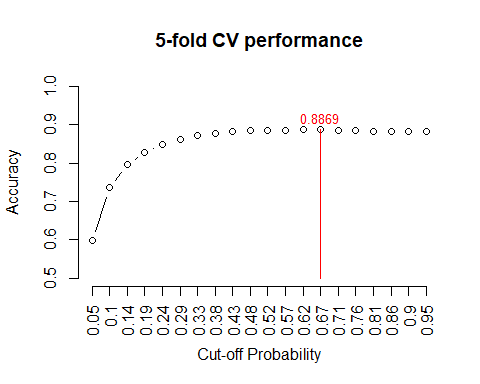

The above figure indicates that the optimal cut-off probability that yields the best accuracy is 0.57.


```r
## Creation of testing model
test.model = glm(y.subscribe ~ age + day + grp.job + marital + education + housing + loan + contact + grp.duration + grp.campaign + grp.pdays + grp.previous, family = binomial(link = logit), data = training)
newBankingTestingData = data.frame(age= testing$age, day= testing$day, grp.job= testing$grp.job, marital= testing$marital, education= testing$education, housing= testing$housing, loan= testing$loan, contact= testing$contact, grp.month= testing$grp.month, grp.duration= testing$grp.duration, grp.campaign= testing$grp.campaign, grp.pdays= testing$grp.pdays, grp.previous= testing$grp.previous)

pred.prob.test = predict.glm(test.model, newBankingTestingData, type = "response")

## Assessing Model Accuracy
testing$test.subscribe = as.numeric(pred.prob.test > 0.62)
a11 = sum(testing$test.subscribe == testing$y.subscribe)
test.accuracy = a11/length(pred.prob.test)
kable(as.data.frame(test.accuracy), align='c')
```


| test.accuracy |
|:-------------:|
|   0.8877829   |
Here in our accuracy test we find that it is accurate 88.7% of the time. This indcates there is no under-fitting for our model.

## Local and Global ROC Metrics

Using the optimal cut-off probability of 0.57, which was found above, we will now report the local measures using our testing data. This includes specificity and sensitivity based on each of these cut-offs for the 20 sub-intervals.


```r
# Looking at sensitivity and specificity performance measurements
testing$test.subscribe = as.numeric(pred.prob.test > 0.57)
### components for defining various measures
p0.a0 = sum(testing$test.subscribe ==0 & testing$y.subscribe ==0)
p0.a1 = sum(testing$test.subscribe ==0 & testing$y.subscribe ==1)
p1.a0 = sum(testing$test.subscribe ==1 & testing$y.subscribe ==0)
p1.a1 = sum(testing$test.subscribe ==1 & testing$y.subscribe ==1)
###
sensitivity = p1.a1 / (p1.a1 + p0.a1)
specificity = p0.a0 / (p0.a0 + p1.a0)
###
precision = p1.a1 / (p1.a1 + p1.a0)
recall = sensitivity
F1 = 2*precision*recall/(precision + recall)
metric.list = cbind(sensitivity = sensitivity, 
                    specificity = specificity, 
                    precision = precision,
                    recall = recall,
                    F1 = F1)
kable(as.data.frame(metric.list), align='c', caption = "Local performance metrics")
```


Table: Local performance metrics

| sensitivity | specificity | precision |  recall   |    F1     |
|:-----------:|:-----------:|:---------:|:---------:|:---------:|
|  0.1181703  |  0.9892401  | 0.5904762 | 0.1181703 | 0.1969296 |

The sensitivity indicates the probability of those clients who are said to have subscribed a term deposit at the banking institution out of those who actually did is about 8-12%. The specificity indicates the probability of those clients who are said to have not subscribed a term deposit at the banking institution out of those who actually did not is about 98.8%. 

### ROC Global Measure Analysis

For the last part of this section, a ROC (receiver operating characteristic) curve will be plotted by selecting a sequence of decision thresholds and calculating corresponding sensitivity and specificity. 


```r
# Creating a final model ROC curve for sensitivity and (1-specificity)
cut.off.seq = seq(0.01, 0.99, length = 100)
sensitivity.vec = NULL
specificity.vec = NULL
for (i in 1:100){
  testing$test.subscribe = as.numeric(pred.prob.test > cut.off.seq[i])
### components for defining various measures
p0.a0 = sum(testing$test.subscribe ==0 & testing$y.subscribe ==0)
p0.a1 = sum(testing$test.subscribe ==0 & testing$y.subscribe ==1)
p1.a0 = sum(testing$test.subscribe ==1 & testing$y.subscribe ==0)
p1.a1 = sum(testing$test.subscribe ==1 & testing$y.subscribe ==1)
###
sensitivity.vec[i] = p1.a1 / (p1.a1 + p0.a1)
specificity.vec[i] = p0.a0 / (p0.a0 + p1.a0)
}
one.minus.spec = c(1,1 - specificity.vec)
sens.vec = c(1,sensitivity.vec)
##
par(pty = "s")   # make a square figure
plot(one.minus.spec, sens.vec, type = "l", xlim = c(0,1),
     xlab ="1 - specificity",
     ylab = "sensitivity",
     main = "ROC curve of Logistic Term Deposit Subscription Final Model",
     lwd = 2,
     col = "blue", )
segments(0,0,1,1, col = "red", lty = 2, lwd = 2)
AUC = round(sum(sens.vec*(one.minus.spec[-101]-one.minus.spec[-1])),4)
text(0.8, 0.3, paste("AUC = ", AUC), col = "blue")
```

<!-- -->


```r
# Creating an initial model ROC curve for sensitivity and (1-specificity)
## 5-fold CV
for (i in 1:5){
  valid.id = ((i-1)*n0 + 1):(i*n0)
  valid.data = training[valid.id,]
  train.data = training[-valid.id,]
  train.model = glm(y.subscribe ~ age + day + grp.job + marital + education + housing + loan + contact + grp.duration + grp.campaign + grp.pdays + grp.previous, family = binomial, data = train.data)
####
  pred.prob = predict.glm(train.model, valid.data, type = "response")
  # define confusion matrix and accuracy
  for(j in 1:20){
    #pred.subscribe = rep(0,length(pred.prob))
    valid.data$pred.subscribe = as.numeric(pred.prob > cut.0ff.prob[j])
    a11 = sum(valid.data$pred.subscribe == valid.data$y.subscribe)
    pred.accuracy[i,j] = a11/length(pred.prob)
  }
}

test.model = glm(y.subscribe ~ age + day + grp.job + marital + education + housing + loan + contact + grp.duration + grp.campaign + grp.pdays + grp.previous, family = binomial(link = logit), data = training)
newBankingTestingData = data.frame(age= testing$age, day= testing$day, grp.job= testing$grp.job, marital= testing$marital, education= testing$education, housing= testing$housing, loan= testing$loan, contact= testing$contact, grp.duration= testing$grp.duration, grp.campaign= testing$grp.campaign, grp.pdays= testing$grp.pdays, grp.previous= testing$grp.previous)

pred.prob.test = predict.glm(test.model, newBankingTestingData, type = "response")

cut.off.seq = seq(0.01, 0.99, length = 100)
sensitivity.vec = NULL
specificity.vec = NULL
for (i in 1:100){
  testing$test.subscribe = as.numeric(pred.prob.test > cut.off.seq[i])
### components for defining various measures
p0.a0 = sum(testing$test.subscribe ==0 & testing$y.subscribe ==0)
p0.a1 = sum(testing$test.subscribe ==0 & testing$y.subscribe ==1)
p1.a0 = sum(testing$test.subscribe ==1 & testing$y.subscribe ==0)
p1.a1 = sum(testing$test.subscribe ==1 & testing$y.subscribe ==1)
###
sensitivity.vec[i] = p1.a1 / (p1.a1 + p0.a1)
specificity.vec[i] = p0.a0 / (p0.a0 + p1.a0)
}
one.minus.spec = c(1,1 - specificity.vec)
sens.vec = c(1,sensitivity.vec)
##
par(pty = "s")   # make a square figure
plot(one.minus.spec, sens.vec, type = "l", xlim = c(0,1),
     xlab ="1 - specificity",
     ylab = "sensitivity",
     main = "ROC curve of Logistic Term Deposit Subscription Initial Model",
     lwd = 2,
     col = "blue", )
segments(0,0,1,1, col = "red", lty = 2, lwd = 2)
AUC = round(sum(sens.vec*(one.minus.spec[-101]-one.minus.spec[-1])),4)
text(0.8, 0.3, paste("AUC = ", AUC), col = "blue")
```

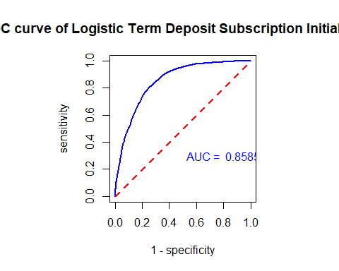<!-- -->


```r
# Creating a reduced model ROC curve for sensitivity and (1-specificity)
## 5-fold CV
for (i in 1:5){
  valid.id = ((i-1)*n0 + 1):(i*n0)
  valid.data = training[valid.id,]
  train.data = training[-valid.id,]
  train.model = glm(y.subscribe ~ day + grp.job + marital + housing + loan + contact + grp.duration + grp.campaign + grp.previous, family = binomial(link = logit), data = train.data)
####
  pred.prob = predict.glm(train.model, valid.data, type = "response")
  # define confusion matrix and accuracy
  for(j in 1:20){
    #pred.subscribe = rep(0,length(pred.prob))
    valid.data$pred.subscribe = as.numeric(pred.prob > cut.0ff.prob[j])
    a11 = sum(valid.data$pred.subscribe == valid.data$y.subscribe)
    pred.accuracy[i,j] = a11/length(pred.prob)
  }
}

test.model = glm(y.subscribe ~ day + grp.job + marital + housing + loan + contact + grp.duration + grp.campaign + grp.previous, family = binomial(link = logit), data = training)
newBankingTestingData = data.frame(day= testing$day, grp.job= testing$grp.job, marital= testing$marital, housing= testing$housing, loan= testing$loan, contact= testing$contact, grp.duration= testing$grp.duration, grp.campaign= testing$grp.campaign, grp.previous= testing$grp.previous)

pred.prob.test = predict.glm(test.model, newBankingTestingData, type = "response")

cut.off.seq = seq(0.01, 0.99, length = 100)
sensitivity.vec = NULL
specificity.vec = NULL
for (i in 1:100){
  testing$test.subscribe = as.numeric(pred.prob.test > cut.off.seq[i])
### components for defining various measures
p0.a0 = sum(testing$test.subscribe ==0 & testing$y.subscribe ==0)
p0.a1 = sum(testing$test.subscribe ==0 & testing$y.subscribe ==1)
p1.a0 = sum(testing$test.subscribe ==1 & testing$y.subscribe ==0)
p1.a1 = sum(testing$test.subscribe ==1 & testing$y.subscribe ==1)
###
sensitivity.vec[i] = p1.a1 / (p1.a1 + p0.a1)
specificity.vec[i] = p0.a0 / (p0.a0 + p1.a0)
}
one.minus.spec = c(1,1 - specificity.vec)
sens.vec = c(1,sensitivity.vec)
##
par(pty = "s")   # make a square figure
plot(one.minus.spec, sens.vec, type = "l", xlim = c(0,1),
     xlab ="1 - specificity",
     ylab = "sensitivity",
     main = "ROC curve of Logistic Term Deposit Subscription Reduced Model",
     lwd = 2,
     col = "blue", )
segments(0,0,1,1, col = "red", lty = 2, lwd = 2)
AUC = round(sum(sens.vec*(one.minus.spec[-101]-one.minus.spec[-1])),4)
text(0.8, 0.3, paste("AUC = ", AUC), col = "blue")
```

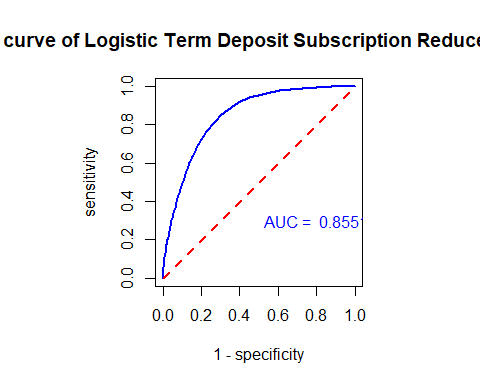<!-- -->

The area under the curve (AUC) for the reduced model and the ROC curve is less than the other two graphs. Higher AUC indicates the model for that curve is better. Therefore, the reduced model is not the best model to use and is no longer considered. But, it should be noted that it is not far off the other 2 models.

Looking at the initial and final models, they have the same curve since both models contain all feature variables used in the initial model. Out of these other two models, the final model works better compared to the initial model. It has been proven to be accurate in modeling performance, has high specificity, and its ROC curve is remaining away from the 45 degrees mark. Plus, the AUC is fairly high at .8525, even though the initial model has the same score.
## Results and Conclusion
Now that we have chosed the best model out of the three candidate models, we can use it to predict whether or not a client has subscribed a term deposit. Using out optimal cut-off of .57


```r
# Predicting Response Value for Banking Client Given Variable Values for the Final Model
pdata = data.frame(age=c(25,64),
                       day = c(5,5),
                       grp.job = c("1","2"),
                       marital = c("0","1"),
                       education = c("2","0"),
                       housing = c("1","1"),
                       loan = c("0","1"),
                       contact = c("0","0"),
                       grp.duration = c("0","1"),
                       grp.campaign = c("1","0"),
                       grp.pdays = c("1","2"),
                      poutcome=c("0","0"),
                       grp.previous = c("1","2"))
          


pred.success.prob = predict(final.model, newdata = pdata, type="response")

## threshold probability
cut.off.prob = 0.57
pred.response = ifelse(pred.success.prob > cut.off.prob, 1, 0)  # This predicts the response
pred.response
```

```
## 1 2 
## 0 0
```

```r
# Add the new predicted response to pdata

#pdata$pred.response <- predict(final.model, newdata = pdata, type = "response")
pdata$Pred.Response = pred.response
kable(pdata, caption = "Predicted Value of response variable with the given cut-off probability")
```


Table: Predicted Value of response variable with the given cut-off probability

| age| day|grp.job |marital |education |housing |loan |contact |grp.duration |grp.campaign |grp.pdays |poutcome |grp.previous | Pred.Response|
|---:|---:|:-------|:-------|:---------|:-------|:----|:-------|:------------|:------------|:---------|:--------|:------------|-------------:|
|  25|   5|1       |0       |2         |1       |0    |0       |0            |1            |1         |0        |1            |             0|
|  64|   5|2       |1       |0         |1       |1    |0       |1            |0            |2         |0        |2            |             0|

You can see that neither of the two observations will be subscribing. More testing can be done with the testing dataset.


# Summary and Discussion

Overall in this project we have done some EDA with linear and logistical regression to answer two questions:
  1. What factors affect the duration of a call?
  2. If we can predict whether a client will subscribe to direct marketing.
  
  In our modeling we cannot rely on the linear model as the assumption have be violated and there is no strong evidence to support and claims. But, in our logistic model we were able to accurately predict whether a client will subscribe to the marketing. Some more EDA and wrangling is needed to fit the linear model, or maybe reworking the question is a more viable solution.


